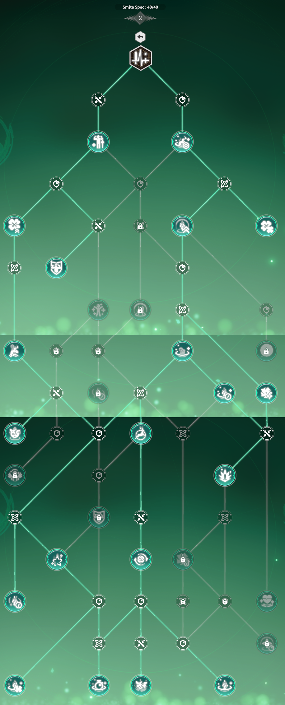

# Base Guide **V**erdant **O**racle **Smite**
The Smite Spec is build around Healing while doing Damage.

***Quoting information by Dr.EvaRosalene (BPSR IGN: DoctorCavori)***
```
[The Specs] healing is actually very strong. [...] but there's a pretty big pitfall
if you don't know how Symbiotic Mark works.Once applied to teammates,
it [converts portion of the damage] to also heal teammates.

In teamfights, Natures Ward (instant shield) and Regen Pulse (long channel with AOE heal,
made INSTANT by one of the factors) are the best ways to cover [10 players] with marks all at once.
Always lead with one of those before casting Infusion (channeled DPS barrage, made uninterruptible
by factors)
for the biggest bulk of your healing - or use specials and normal attacks if you don't
have it ready or want to save it and build Stag Charge instead.

The Stag Charge is a special upgrade to Wild Bloom, the first Ability
 when achieving 10 stacks of Bloom.
When cast it will instantly refresh Infusion with an upgrade to it,
which causes it to do double damage. [...]
```


For Combat Rotation the following can be used:

- Start with Nature Ward, then if needed Regen Pulse (To get everyone with a Symbiotic Mark)
- Continue with the following idea:
  - Infusion anytime it is up
  - Feral Seed for Stacks and Energy Regen
  - Wild Bloom to Reduce CoolDowns + Stacks
    - Wild Bloom can, with 10 Stacks, turn into Stag Charge and improve Infusion


## Talent Tree

in the Picture you can see the *current* (2026 - 02 - 24) variant **I** use.

Tree 1 is forced to be 100% learned, else you cannot learn any Specification.

Tree 2 the following parts are in the picture used:

- Nature Shield (heals also give shield)
- Pulse Duality (next to each other)
- Regen Bud


